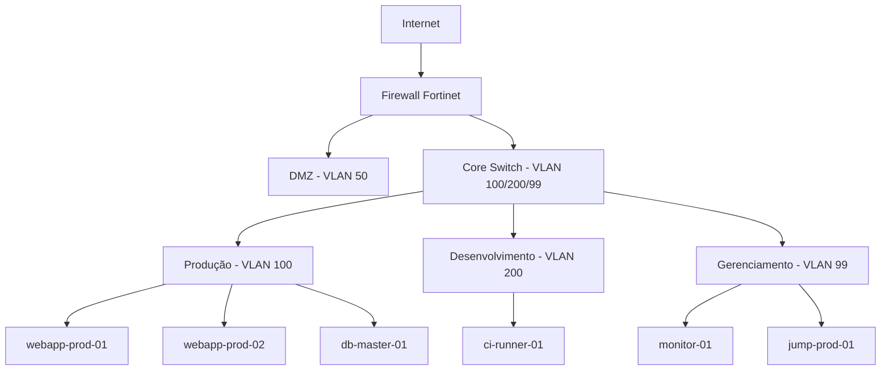

# Topologia de Rede

## Visão Geral

Documentação completa da topologia de rede da infraestrutura.

---

## Segmentos de Rede

| Rede | CIDR | VLAN | Uso |
|------|------|------|-----|
| Produção | `10.0.0.0/24` | 100 | Servidores |
| Desenvolvimento | `10.0.1.0/24` | 200 | Dev/QA |
| DMZ | `10.0.2.0/24` | 50 | Servidores externos |
| Gerenciamento | `10.0.3.0/24` | 99 | OOB/IPMI |

---

## Diagrama da Topologia

---

## Rotas e Firewalls

| Origem | Destino | Via | Protocolo |
|--------|---------|-----|-----------|
| 10.0.0.0/24 | 0.0.0.0/0 | Firewall | NAT/SNAT |
| 10.0.1.0/24 | 10.0.0.0/24 | Core Switch | Roteamento interno |
| 10.0.2.0/24 | 10.0.0.0/24 | Firewall | Filtrado |

---

## Ver Também

- [Equipamentos de Rede](equipamentos.md)
- [Troubleshooting de Queda de Link](troubleshooting-queda-link.md)
- [VPN e Acesso Remoto](vpn.md)
