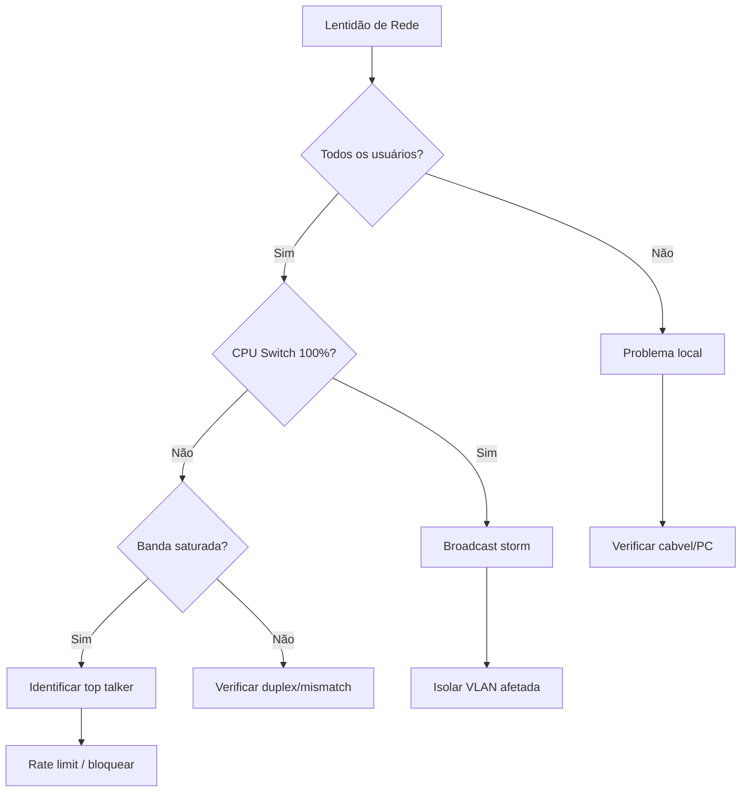

# Troubleshooting - Lentidão de Rede

## Sintomas

- Lentidão ao acessar sistemas
- Downloads lentos
- Alto uso de CPU nos switches
- Usuários reclamando de "travamentos"

---

## Diagnóstico Rápido

### 1. Verificar utilização de banda

```bash
# MikroTik - Ver tráfego
/interface monitor ethernet1
/tool bandwidth-test 8.8.8.8 duration=30

# Ver top talkers
/ip firewall connection print
```

### 2. Verificar erros na interface

```bash
# Verificar erros CRC e colisões
/interface ethernet monitor [find]
/tool ethernet-test [find interface="ether1"]
```

### 3. Verificar CPU e memória

```bash
# MikroTik
/system resource print
/system health print
```

---

## Fluxo de Resolução



---

## Causas Comuns

| Causa | Sintoma | Solução | Prevenção |
|-------|---------|---------|-----------|
| Broadcast storm | CPU 100%, tudo lento | Isolar origem, STP | Monitorar broadcasts |
| Duplex mismatch | Erros CRC altos | Ajustar velocidade/duplex | Auto-negotiate |
| MTU inadequado | Fragmentação, lentidão | Ajustar MTU | Padrão 1500 |
| Spanning tree loop | Convergência lenta | Verificar topologia | RSTP habilitado |
| Bandwidth saturada | Downloads lentos | QoS / Rate limit | Monitorar tráfego |
| Cabo ruim | Lentidão intermitente | Substituir cabo | Testar periodicamente |

---

## Ferramentas de Diagnóstico

| Ferramenta | Comando | Uso |
|------------|---------|-----|
| `bandwidth-test` | `tool bandwidth-test <ip>` | Testar banda MikroTik |
| `mtr` | `mtr 8.8.8.8` | Rota + latência |
| `iftop` | `iftop -i eth0` | Top talkers Linux |
| `nethogs` | `nethogs eth0` | Processos por conexão |

---

## Ver Também

- [Equipamentos de Rede](equipamentos.md)
- [Troubleshooting de Queda de Link](troubleshooting-queda-link.md)
