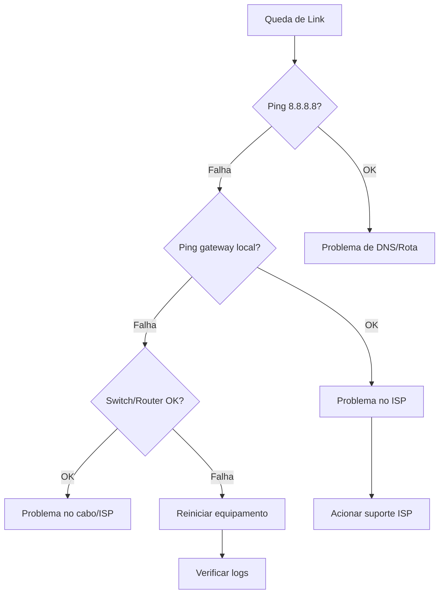

# Troubleshooting - Queda de Link

## Sintomas

- Perda total de conectividade externa
- Usuários sem acesso à internet
- Monitoramento alarmado (Zabbix/PRTG)

---

## Diagnóstico Rápido

### 1. Verificar status do link

```bash
# Testar conectividade
ping -c 5 8.8.8.8
ping -c 5 1.1.1.1

# Verificar rota
traceroute 8.8.8.8
mtr 8.8.8.8
```

### 2. Verificar interface do roteador (MikroTik)

```bash
# Ver status das interfaces
/interface print
/interface monitor ether1-wan

# Ver pacotes
/tool traffic-print
```

### 3. Verificar firewall (Fortinet)

```bash
# Ver logs
diagnose debug flow filter addr 8.8.8.8
diagnose debug flow trace start 10
diagnose debug enable
```

### 4. Verificar se é ISP

```bash
# Verificar status da porta do ISP
/interface ethernet monitor [find name~"wan"]
```

---

## Fluxo de Resolução



---

## Causas Comuns e Soluções

| Causa | Sintoma | Solução | Tempo |
|-------|---------|---------|-------|
| Manutenção ISP | Queda total | Aguardar / failover | Variável |
| Cabo danificado | Queda intermitente | Verificar física | 30min |
| Configuração errada | Queda após change | Revert change | 15min |
| Hardware defeituoso | Queda total | Failover / substituir | 1-4h |
| Ataque DDoS | Lentidão + queda | Blackhole / contact NOC | Variável |

---

## Contatos ISP

| ISP | Suporte | Chamado |
|-----|---------|---------|
| Embratel | `(11) 3000-1000` | `suporte@embratel.com.br` |
| Vivo | `(11) 9999-9999` | `suporte@vivo.com.br` |

---

## Ver Também

- [Equipamentos de Rede](equipamentos.md)
- [Topologia de Rede](topologia.md)
- [Runbook de Incidentes](../../runbooks/incidentes/README.md)
