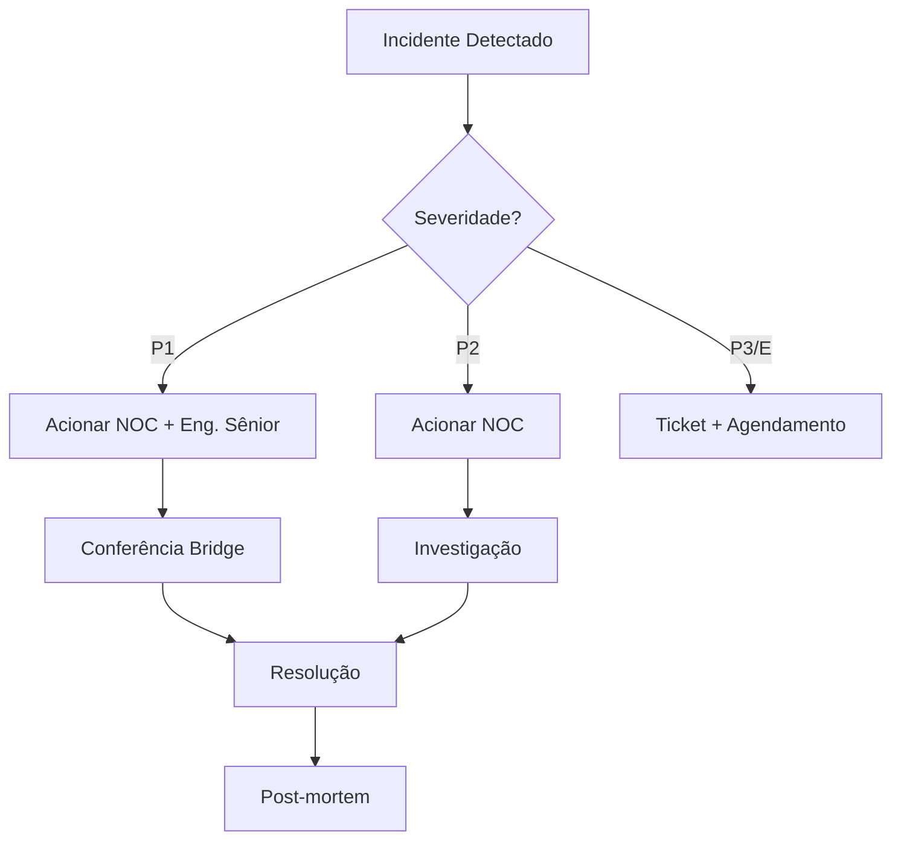

# Runbooks de Incidentes

## Visão Geral

Procedimentos padronizados para resposta a incidentes de infraestrutura.

---

## Classificação de Incidentes

| Severidade | Descrição | Tempo Resposta | Exemplo |
|------------|-----------|----------------|---------|
| **P1 - Crítico** | Sistema indisponível | 15 min | Queda total, banco fora |
| **P2 - Alto** | Funcionalidade degradada | 30 min | Lentidão grave, erro intermitente |
| **P3 - Médio** | Funcionalidade parcial | 2 horas | Componente offline, alerta |
| **P4 - Baixo** | Impacto mínimo | 8 horas | Bug não crítico, melhoria |

---

## Runbooks Disponíveis

| Runbook | Severidade | Descrição |
|---------|------------|-----------|
| [Queda de Link](queda-link.md) | P1 | Queda de conectividade externa |
| [Lentidão de Rede](lentidao-rede.md) | P2 | Lentidão na rede interna |
| [Serviço Down](servico-down.md) | P1/P2 | Serviço indisponível |
| [DDoS](ddos.md) | P1 | Ataque de negação de serviço |
| [Disco Cheio](disco-cheio.md) | P2 | Espaço em disco insuficiente |
| [SSL Expirado](ssl-expirado.md) | P3 | Certificado SSL vencido |

---

## Fluxo de Escalonamento

---

## Contatos de Emergência

| Função | Contato | Disponibilidade |
|--------|---------|-----------------|
| NOC 24h | `(11) 3000-1000` | 24/7 |
| Eng. Sênior | `(11) 9999-8888` | 24/7 (P1) |
| Gerente Infra | `(11) 9999-7777` | Horário comercial |

---

## Ver Também

- [Manutenções](../manutencoes/README.md)
- [Backups](../backups/README.md)
