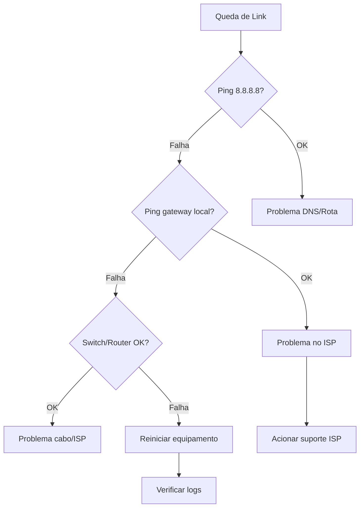

# Queda de Link

## Sintomas

- Perda total de conectividade externa
- Usuarios sem acesso a internet
- Monitoramento alarmado

---

## Diagnostico Rapido

### 1. Verificar status do link

```bash
ping -c 5 8.8.8.8
ping -c 5 1.1.1.1
traceroute 8.8.8.8
mtr 8.8.8.8
```

### 2. Verificar roteador (MikroTik)

```bash
/interface print
/interface monitor ether1-wan
```

### 3. Verificar firewall (Fortinet)

```bash
diagnose debug flow filter addr 8.8.8.8
diagnose debug flow trace start 10
diagnose debug enable
```

---

## Fluxo de Resolucao



---

## Causas Comuns

| Causa | Sintoma | Solucao |
|-------|---------|---------|
| Manutencao ISP | Queda total | Aguardar / failover |
| Cabo danificado | Queda intermitente | Verificar fisica |
| Configuracao errada | Queda apos change | Revert change |
| Hardware defeituoso | Queda total | Failover / substituir |

---

## Contatos ISP

| ISP | Suporte |
|-----|---------|
| Embratel | `(11) 3000-1000` |
| Vivo | `(11) 9999-9999` |

---

## Ver Tambem

- [Equipamentos de Rede](../../infra/rede/equipamentos.md)
- [Topologia de Rede](../../infra/rede/topologia.md)
