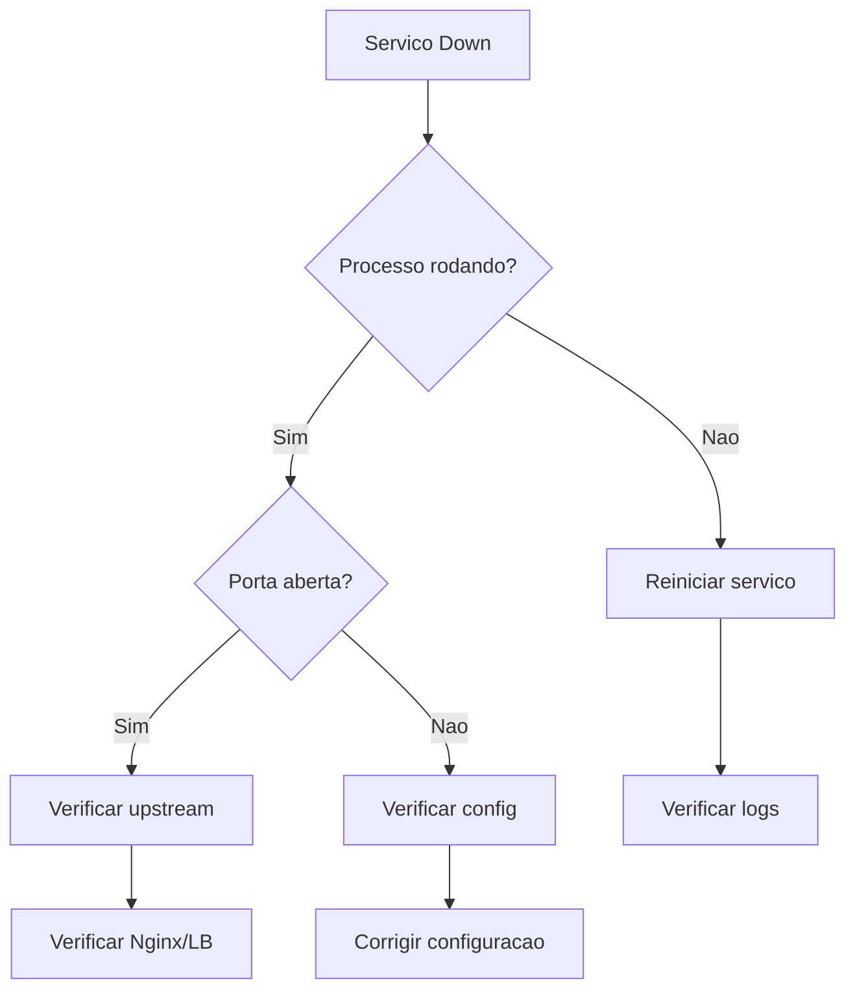

# Servico Down

## Sintomas

- Servico retorna erro 5xx
- Servico nao responde
- Healthcheck falhando

---

## Diagnostico Rapido

### 1. Verificar status do servico

```bash
systemctl status <servico>
docker ps
pm2 list
```

### 2. Verificar portas

```bash
ss -tlnp | grep <porta>
netstat -tlnp | grep <porta>
```

### 3. Verificar logs

```bash
journalctl -u <servico> -f
tail -f /var/log/<servico>/*.log
```

---

## Fluxo de Resolucao



---

## Ver Tambem

- [Queda de Link](queda-link.md)
- [Lentidao de Rede](lentidao-rede.md)
